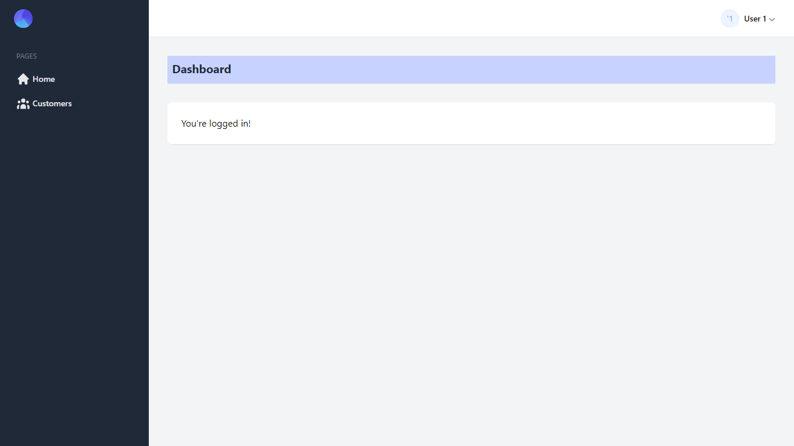

# Laravel React Inertia Tailwind starter kit

## Includes Laravel Fortify for authentication

## Introduction

This starter kit provides a minimal and simple starting point for building a Laravel application with authentication. Styled with Tailwind. It also includes [Laravel Fortify](https://laravel.com/docs/8.x/fortify) which publishes authentication controllers to your application that can be easily customized based on your own application's needs.

This starter is powered by React, Inertia, Tailwind and Laravel.

### Includes

-   Laravel v8.40
-   Laravel fortify v1.7
-   Laravel sail v1.0.1
-   React v17.0.2
-   React prop-types v15.7.2
-   Inertia v0.8.7
-   Inertia-react v0.5.12
-   Inertia-laravel v0.4.2
-   Inertia-progress v0.2.4
-   Tailwindcss v2.1.2
-   Ziggy v1.2

## Notable Packages

-   [Laravel](https://laravel.com) - Backend 🎰
-   [ReactJs](https://reactjs.com) - Frontend 💻
-   [InertiaJs](https://inertiajs.com) - Mediator(Helps discard API) 🧑‍🦯
-   [Tailwindcss](https://tailwindcss.com) - Styling 💅

## How do I set this up

### Installation Via Composer

If your computer already has PHP and Composer installed, you may create a new project by using Composer directly.

```bash
1. composer create-project nwanguma/atlas your-project-name

2. npm install

3. npm run dev

4. cp .env.example .env

5. php artisan key:generate

6. php artisan storage:link

```

## To remove the documentation

-   windows
    ```bash
    1. rmdir /s docs
    2. del README.md
    3. echo "" > README.md
    ```
-   linux
    ```bash
    1. rm -r docs
    2. rm README.md
    3. touch README.md
    ```

## Just Reminders 😅

-   Make Hard Visits with

    ```
    Inertia::Location(route('login'));
    ```

    Good for those pages that require refresh of sessions, to avoid 419 error (Page Expired).

-   Global alias

    ```bash
    const path = require('path');

    .webpackConfig({
        resolve: {
            alias: {
                //making a global alias
                '@': path.resolve('resources/js')
            },
        },
    });
    ```

    I made a global alias '@' for absolute path imports.

## How it looks





