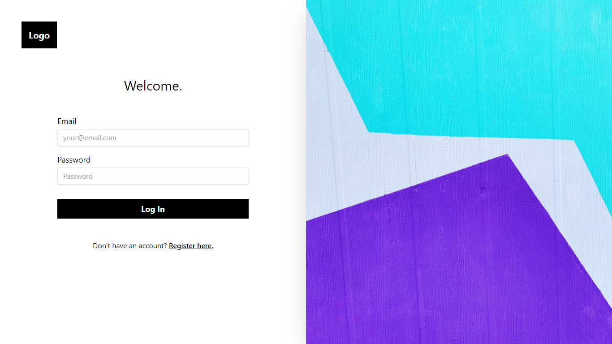
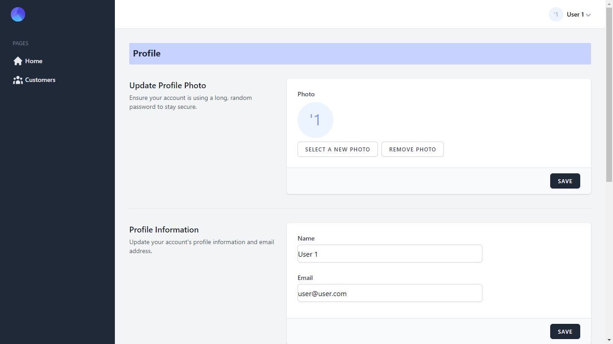
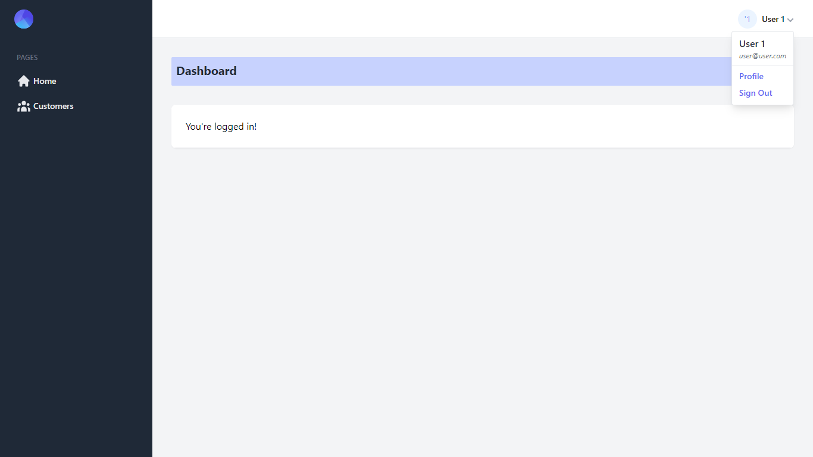

# Atlas

## A Laravel, React (Typescript), Inertia & Tailwind starter kit. (Jetstream alternative)

Includes Laravel Fortify for authentication

## Introduction

This starter kit provides a minimal and simple starting point for building a Laravel application with authentication. Styled with Tailwind. It also includes [Laravel Fortify](https://laravel.com/docs/8.x/fortify) which publishes authentication controllers to your application that can be easily customized based on your own application's needs.

This starter is powered by React, Inertia, Tailwind and Laravel.

### Includes

- Laravel v10.0
- Laravel Fortify v1.7
- Laravel Sail v1.18
- React v18.2
- Inertia React v1.0.2
- Inertia Laravel v0.6.9
- Tailwind CSS v3.2
- Ziggy v1.5

## Notable Packages

- [Laravel](https://laravel.com) - Backend 🎰
- [ReactJs](https://reactjs.com) - Frontend 💻
- [InertiaJs](https://inertiajs.com) - Mediator(Helps discard API) 🧑‍🦯
- [Tailwind CSS](https://tailwindcss.com) - Styling 💅

## How do I set this up

### Installation Via Composer

If your computer already has PHP and Composer installed, you may create a new project by using Composer directly.

```bash
composer create-project nwanguma/atlas <your-project-name>

cd <your-project-name>

npm install

php artisan storage:link

php artisan migrate

npm run dev

php artisan serve
```

## To remove the documentation

- Windows
  ```bash
  rmdir /s docs
  del README.md
  ```
- Linux
  ```bash
  sudo rm -r docs
  rm README.md
  ```

## Just Reminders 😅

- Make Hard Visits with

  ```php
  Inertia::Location(route('login'));
  ```

  Good for those pages that require refresh of sessions, to avoid 419 error (Page Expired).

- Global alias

  ```js
  const path = require("path");

  export default defineConfig({
    // ...
    resolve: {
      alias: {
        "@": path.resolve(__dirname, "resources/ts"),
      },
    },
  });
  ```

  Global alias `@` for absolute path imports.

## How it looks








## Want to Contribute?

Feel free to create a pull request.
